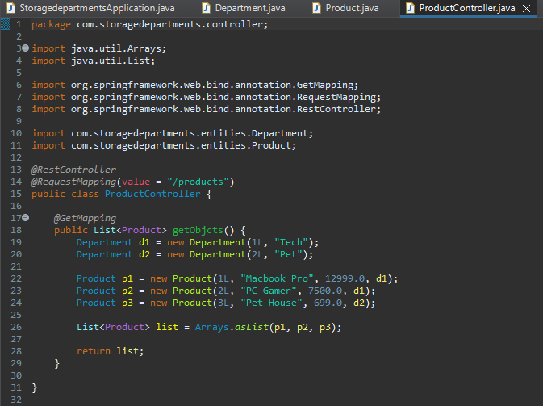

# SpringMart-API  

## About the project📜
Spring Boot REST API for registering/searching for products or services, which also simulates the organization of inventories, with typical data such as name, price and department
## Technologies used 💻⚙️
- Spring Tool Suite 4
- JDK 17
- Maven
- Spring Boot 3.1.0
- JPA
- Postman

## Examples of features/operations
### Creating EndPoints


### Testing the service
#### 
```bash
Without formatting
```


```bash
JSON format through Postman
```

