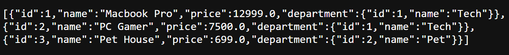
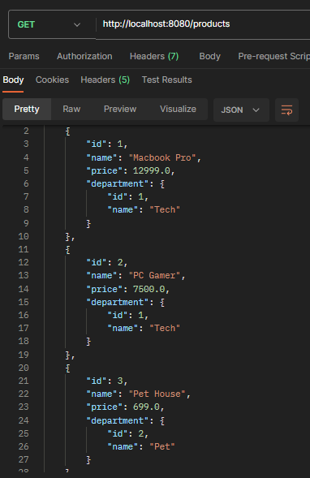

# storage-in-departments-api 

## About the project📜
REST API with Spring Boot for registering and searching for products.

## Technologies used 💻⚙️
- Spring Tool Suite 4
- JDK 17
- Maven
- Spring Boot 3.1.0
- JPA
- Postman

## Examples of features/operations
### Creating EndPoints


### Testing the service
#### 
```bash
Without formatting
```


```bash
JSON format through Postman
```

